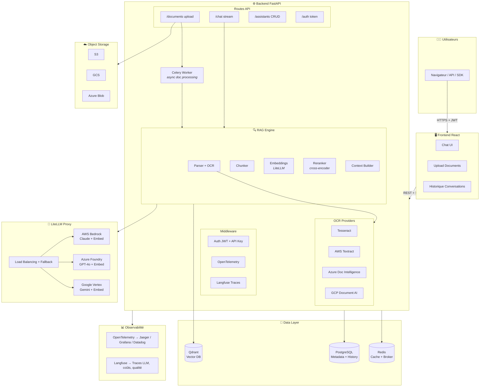
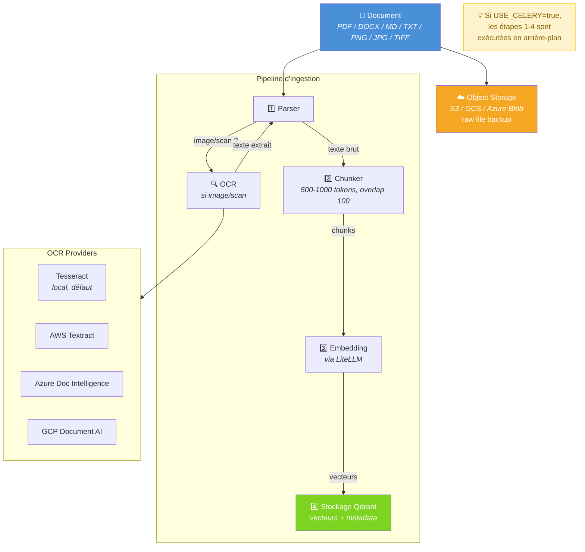
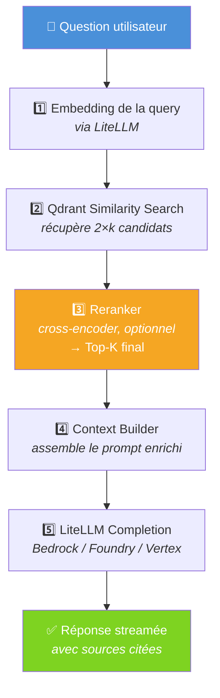
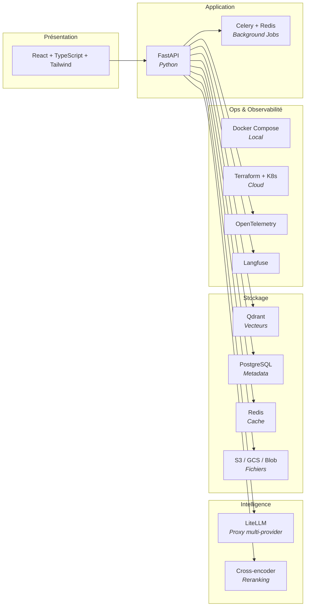
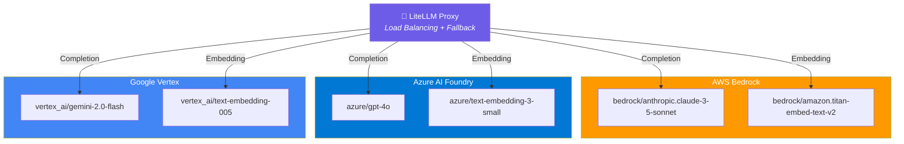
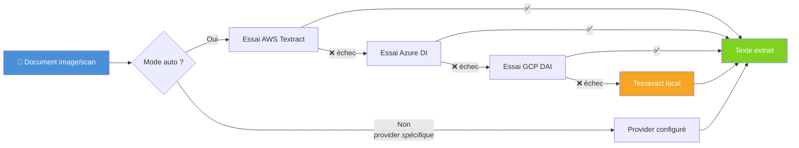
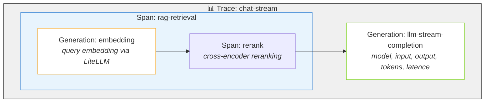
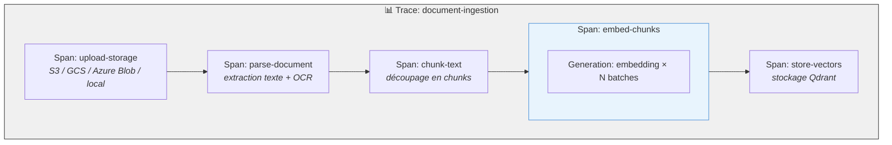
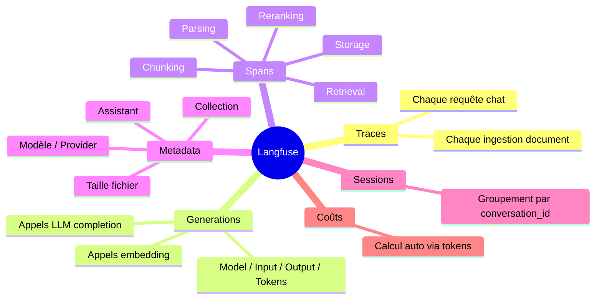

# Architecture - Enterprise Chat + RAG avec LiteLLM (v2.0)

## 1. Vue d'ensemble

---

## 2. Flux d'ingestion de documents

---

## 3. Flux Chat avec RAG

---

## 4. Stack technique

---

## 5. Modèles supportés via LiteLLM

---

## 6. OCR multi-provider (fallback)

---

## 7. Observabilité Langfuse — Traces

### Chat Request

### Document Ingestion

### Données capturées par Langfuse

