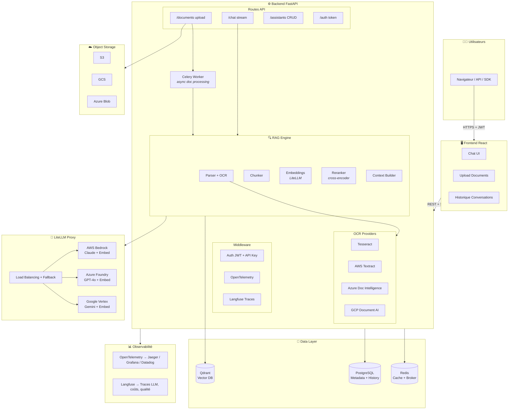
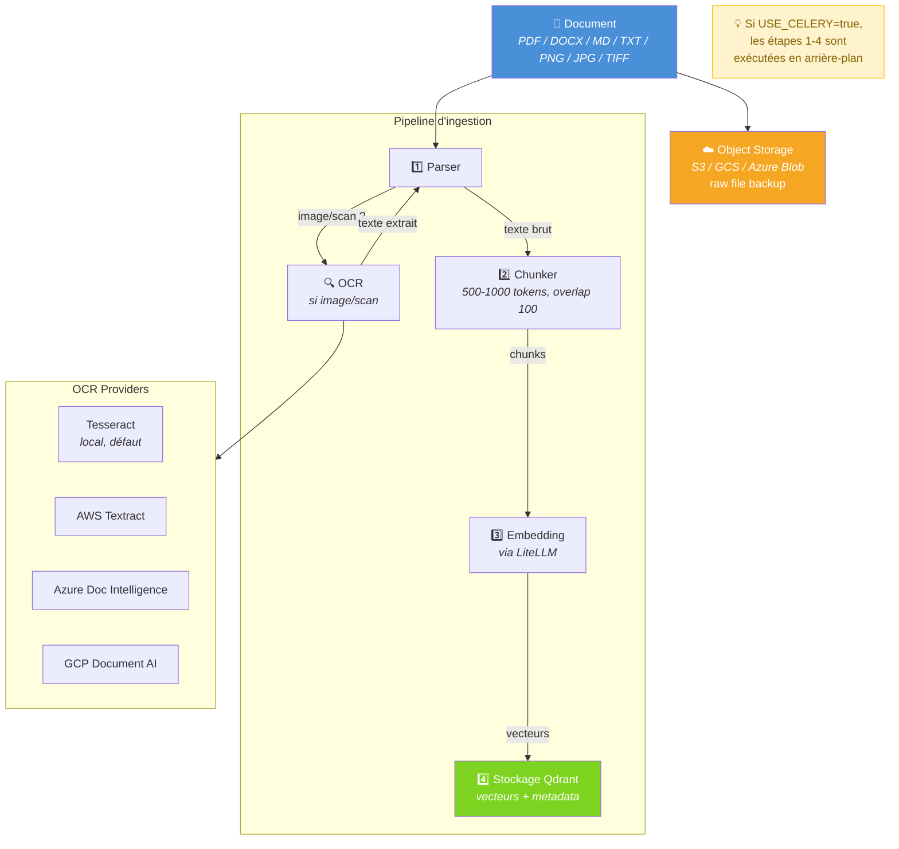
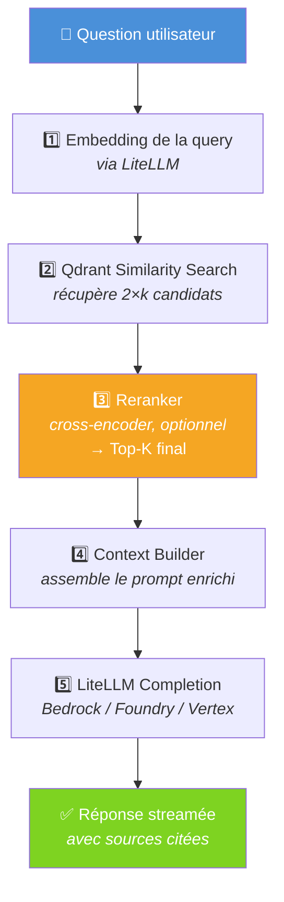
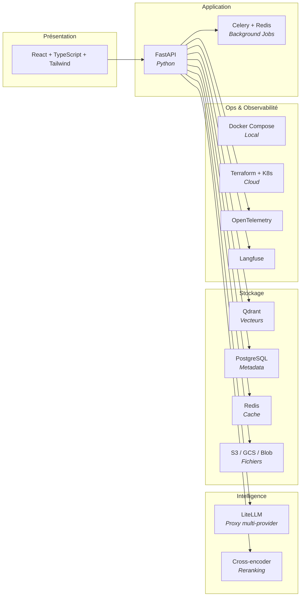
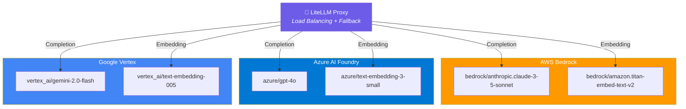
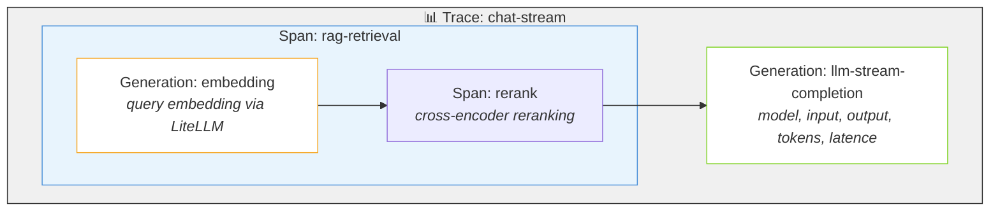
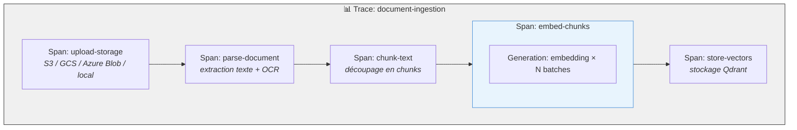
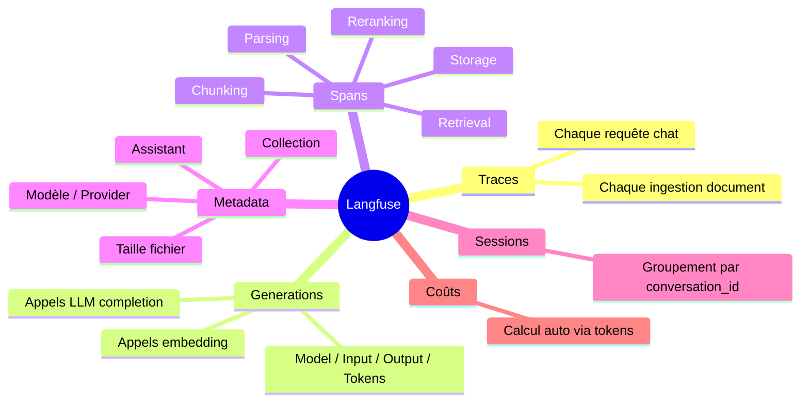

# Architecture - Enterprise Chat + RAG avec LiteLLM (v2.0)

## 1. Vue d'ensemble



---

## 2. Flux d'ingestion de documents



---

## 3. Flux Chat avec RAG



---

## 4. Stack technique



---

## 5. Modèles supportés via LiteLLM



## Stack technique

| Composant | Technologie | Rôle |
|-----------|------------|------|
| Frontend | React + TypeScript + Tailwind | Interface chat |
| Backend | FastAPI (Python) | API REST + SSE |
| LLM Proxy | LiteLLM | Routage multi-provider |
| Vector DB | Qdrant (self-hosted ou Cloud) | Stockage embeddings |
| Database | PostgreSQL (ou RDS/Cloud SQL) | Métadonnées + historique |
| Cache | Redis (ou ElastiCache) | Cache + broker Celery |
| Object Storage | S3 / GCS / Azure Blob | Fichiers bruts |
| Background | Celery + Redis | Ingestion async |
| Auth | JWT + API Keys | Authentification |
| Reranking | Cross-encoder via LiteLLM | Précision RAG |
| Observabilité infra | OpenTelemetry | Tracing distribué (latence, erreurs) |
| Observabilité LLM | Langfuse | Traces LLM, coûts, qualité, debug |
| Containers | Docker Compose | Orchestration locale |
| Cloud | Terraform + K8s | Déploiement cloud |

## OCR multi-provider

| Provider | Service | Configuration |
|----------|---------|---------------|
| Local | Tesseract (fra+eng) | Par défaut, aucune config |
| AWS | Textract | `OCR_PROVIDER=aws_textract` + AWS creds |
| Azure | Document Intelligence | `OCR_PROVIDER=azure_di` + endpoint + key |
| Google | Document AI | `OCR_PROVIDER=google_docai` + processor ID |
| Auto | Essaie cloud → local | `OCR_PROVIDER=auto` |

En mode `auto`, le système essaie chaque provider cloud configuré dans l'ordre
(AWS → Azure → Google), puis fallback sur Tesseract local si tous échouent.

Formats supportés : PDF (hybride texte+scan), PNG, JPG, JPEG, WebP, BMP, TIFF (multi-page).

## Modèles supportés via LiteLLM

### Mode Cloud (multi-provider)

| Provider | Completion | Embedding |
|----------|-----------|-----------|
| AWS Bedrock | `bedrock/anthropic.claude-3-5-sonnet-20241022-v2:0` | `bedrock/amazon.titan-embed-text-v2:0` |
| Azure AI Foundry | `azure/gpt-4o` | `azure/text-embedding-3-small` |
| Google Vertex | `vertex_ai/gemini-2.0-flash` | `vertex_ai/text-embedding-005` |

### Mode Local (LM Studio) — Zero Cloud

Pour une version 100% locale sans aucune dépendance cloud, le projet supporte
LM Studio comme backend LLM via son API compatible OpenAI.

#### Démarrage rapide

```bash
cp .env.local.example .env
docker compose -f docker-compose.yml -f docker-compose.local.yml up
```

#### Prérequis

1. **LM Studio** installé et démarré sur la machine hôte
2. Serveur activé sur le **port 1234** (Developer → Local Server → Start)
3. Modèles chargés (voir tableau ci-dessous)

#### Modèles recommandés à charger dans LM Studio

| Usage | Modèle recommandé | VRAM | Notes |
|-------|-------------------|------|-------|
| **Completion** | `Qwen2.5-7B-Instruct` | ~5 GB | Excellent rapport qualité/taille, multilingue FR/EN |
| **Completion** | `Mistral-7B-Instruct-v0.3` | ~5 GB | Bon en français, rapide |
| **Completion** | `Meta-Llama-3.1-8B-Instruct` | ~5 GB | Très polyvalent |
| **Completion (puissant)** | `Qwen2.5-14B-Instruct` | ~10 GB | Meilleure qualité, nécessite plus de VRAM |
| **Completion (léger)** | `Qwen2.5-3B-Instruct` | ~2 GB | Pour machines avec peu de VRAM |
| **Embedding** | `nomic-ai/nomic-embed-text-v1.5-GGUF` | ~0.3 GB | 768 dims, excellent pour RAG |
| **Embedding** | `CompendiumLabs/bge-large-en-v1.5-gguf` | ~0.4 GB | 1024 dims, très précis |
| **Embedding** | `second-state/all-MiniLM-L6-v2-GGUF` | ~0.1 GB | 384 dims, ultra léger |

> **Minimum recommandé** : 1 modèle completion + 1 modèle embedding.
> Avec 8 GB de VRAM : Qwen2.5-7B + nomic-embed-text.
> Avec 16 GB+ de VRAM : Qwen2.5-14B + nomic-embed-text.

#### Configuration LM Studio

Dans LM Studio :
1. **Developer** → **Local Server** → **Start Server** (port 1234)
2. Charger le modèle de completion → il sera disponible via l'API
3. Charger le modèle d'embedding → il sera disponible sur `/v1/embeddings`

> **Important** : LM Studio doit avoir les deux modèles chargés simultanément
> (completion + embedding). Activez "Allow multiple models" dans les paramètres.

#### Architecture locale

```
┌──────────────┐     ┌──────────────┐     ┌──────────────────────┐
│   Frontend   │────→│   Backend    │────→│   LiteLLM Proxy      │
│   React      │     │   FastAPI    │     │   (config.local.yaml)│
└──────────────┘     └──────┬───────┘     └──────────┬───────────┘
                            │                        │
                     ┌──────▼───────┐         ┌──────▼───────────┐
                     │  Qdrant      │         │  LM Studio       │
                     │  (Docker)    │         │  (host machine)  │
                     └──────────────┘         │  - Qwen 2.5 7B   │
                            │                 │  - nomic-embed    │
                     ┌──────▼───────┐         └──────────────────┘
                     │  PostgreSQL  │
                     │  Redis       │
                     │  (Docker)    │
                     └──────────────┘
```

Tout tourne en local : pas d'API key cloud, pas de données envoyées à l'extérieur.

## Langfuse - Observabilité LLM

Langfuse trace chaque requête de bout en bout pour offrir une visibilité complète
sur les appels LLM, les coûts, la latence et la qualité des réponses.

### Configuration

```env
LANGFUSE_ENABLED=true
LANGFUSE_PUBLIC_KEY=pk-lf-...
LANGFUSE_SECRET_KEY=sk-lf-...
LANGFUSE_HOST=https://cloud.langfuse.com    # ou self-hosted: http://langfuse:3000
```

---

## 7. Observabilité Langfuse — Traces

### Chat Request



### Document Ingestion



### Données capturées par Langfuse


